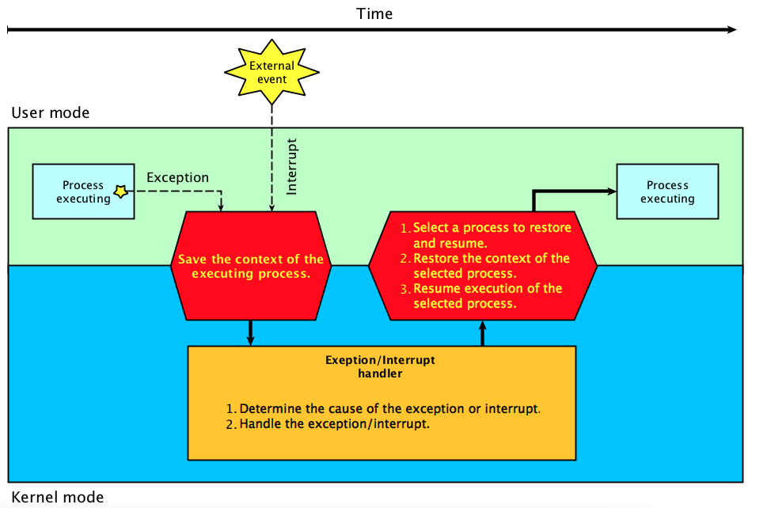
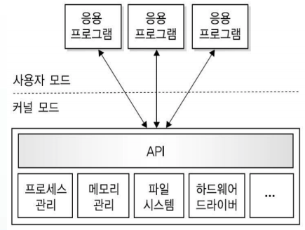

# 컴퓨터의 구조

- CPU
Central Process Unit, 중앙처리 장치를 말함, 컴퓨터 성능을 결정짓는 중요 요소이자, 컴퓨터 아키텍쳐 수업에서도 CPU의 Excution Time을 Performance의 지표로 삼기도 하고, 우리가 사용하고 있는 노트북의 i5,i7등을 말합니다.

- Ram
CPU의 연산결과를 저장하고 처리할 . 수있는 공간, 프로그램이 동작하는 것은 사실 프로그램들이 메모리에 읽혀져 동작하게 되는 것이기 때문에 RAM의 크기 역시 컴퓨터의 처리속도를 결정짓는데 중요 영향을 끼침, 메모리 용량이 클수록 여러 프로그램이 실행이 가능하고

높은 성능이 보장 가능합니다. 하지만 램은 **전원이 꺼질경우 내용이 지워지기 때문**에 영구적으로 저장해야 하는 데이터는 하드디스크 장치에 저장해야 함

- HDD(하드디스크)
영구적으로 데이터를 저장하기 위한 정치, 컴퓨터를 껏다가 켜도 남아있는 내용, 예를들어 인터넷, 워드 Editor같은 프로그램들은 하드디스크에 저장되어 있음, 최근에는 메모리 기반의 HDD인 SSD(solid state Disk)의 가격이 많이 저렴해져 많이 보급되고 있는데 이를 통해 많은 양의 데이터가 저장이 가능함

- 메인보드는 쉽게 생각해서 하드웨어를 꽂아두는 몸통이라고 생각할 수 있음

- GPU 
  컴퓨터에서 그래픽 처리를 전문적으로 하는 하드웨어, 최근에는 GPU의 성능이 ML,DL의 학습에 있어 굉장히 중요한 요소가 되었기 때문에 GPU의 중요성이 커지고 있음

# 운영체제란(OS?)
하드웨어 장치를 유저가 사용할 수 있도록 환경을 제공하는 소프트웨어

사용자가 컴퓨터 구조를 알지못해도 또는 커널의 명령으로 컴퓨터와 의사소통 할 수 있는 것이 운영체제가 있기 때문

자바로 코드를 하나 실행시킨다고 했을때 코드 중 하드디스크, RAM에 저장되어 있는 데이터를 read(), write()하는 작업이 있을수 있는데 **코드가 어떻게 그 작업이 가능할까요?**

이게 바로 OS의 역활입니다. 유저 코드에서 Read Call이 발생하면 해당 장치를 핸들링 하기 위해 User Mode에서 Kernal Mode로 바뀌게 되고, 그곳에서  작업을 완료한 뒤 다시 User Mode 로 돌아와 프로그램을 수행하는 것을 말합니다.

여기서 중요한 개념 두가지가 나타나게 되는데요 바로 **폴링**과 **인터럽트** 입니다.

- 폴링 
운영체제가 장치사용을 감시하기 위해 장치의 동작여부를 수시로 체크, 하지만 수시로 할 경우 에너지 낭비가 심해짐, 따라서 장치에서 이벤트 발생시 해당 이벤트 통지하는 인터럽트 개념이 사용됨
- 인터럽트
프로그램이 실행하는 동안 I/O 장치의 사용이나 예외가 발생하면 이를 CPU에게 알려서 처리하도록 하는 역활을 함, 폴링보다 효율적

# 이중동작 모드와 OS의 역활
이중 동작모드는 OS가 이상한 프로그램으로 인해 잘못 동작하거나 망가지지 않게하는 아주 중요한 핵심 동작 원리임

`듀얼`이라는 말처럼 OS는 User mode와 Kernal Mode 두가지 모드를 두고 동작하는데, 유저모드에서는 어플리케이션이 동작하고 사용자가 컴퓨터와 상호작용하는 등의 일이 이루어 집니다. 

반면 커널모드에서는 드라이버, CPU, 메모리 등에 접근하고 명령을 내리고 이러한 작업들이 이루어지기 위한 근본적인 작업들을 처리합니다. 

이 때, 특정한 권한 명령들은 무조건 커널모드에서만 수행되어야만 하는데 유저 마음대로 OS의 작동을 좌지우지 한다면 하드웨어 장치나 메모리가 오작동하거나 심지어는 공격을 받을수 있기 떄문입니다. 

그러면 **언제/어떻게 유저모드에서 커널모드로 전환될까요?** 바로 위에서 살펴본 인터럽트가 발생할떄 입니다. 그리고 인터럽트는 유저가 적절한 시스템 콜을 통해 OS에게 커널 모드로 가서 요청한 작업을 해달라는 메시지를 보낼떄 발생하게 됩니다.

그림을 보면 OS는 빨간색으로 표시된 시스템 콜을 통해 커널 모드에 가서 파일 시스템을 관리, I/O작업 관리, 메모리 관련 등의 작업을 수행하고, 초록색 박스로 표현된 Hardware Control을 통해 진짜 하드웨어와 소통하게 합니다. 

# Interrupt
## 1. 인터럽트 개념
인터럽트는 중요한 개념이기 때문에 좀 더 자세히 살펴보도록 하겠습니다. 

인터럽트란 CPU가 프로그램을 실행하고 있을떄 입출력 하드웨어 등의 장치사용이나 프로그램 내 예외상황등이 발생하여 처리학 필요할때 프로세서에게 이를 알려주는것을 말합니다. 

인터럽트에는 크게 하드웨어(HW)와 소프트웨어(SW) 인터럽트가 있고 시스템 콜 역시 이와 비슷한 역활을 수행하여 프로세스에게 유저 모드에서 커널모드로 가서 특정 작업을 수행할 것을 요구하게 됩니다. 

그렇다면 하드웨어 / 소프트웨어 인터럽트란 무엇을 말하는지 시스템 콜을 정확히 무엇을 말하는지 짚어보겠습니다.

- Hardware Interrrupt:
  하드웨어가 발생시키는 인터럽트로, CPU가 아닌 다른 하드웨어 장치가 CPU가 아닌 다른 하드웨어 장치가 CPU에 어떤 사실을 알려주거나 CPU 서비스를 요청해야 할 경우 발생시킵니다. 정전 또는 전원 공급의 이상, CPU 또는 기타 하드웨어의 오류등도 하드웨어 인터럽트에
  포함됩니다. 
- Software Interrupt(Exception)
  CPU 내부에서 실행되면서 인터럽트를 발생시키는 경우로써 프로그램 코드를 돌리는 과정에서 Exception이 발생할때 Kernal Mode 로 전환하여 에러를 핸들링하는 경우를 말합니다. 예시로는 Divide by ero, Overflow, Underflow 등이 있습니다. 
- System Call 
  사용자가 프로그램을 실행시키거나, OS를 호출하는 동작을 수행하는 경우에 일어납니다. 모든 프로그램은 자신의 독자적인 주소 공간을 가지고 있으며, 프로그램이 함수를 호출하는 경우 자신의 주소 공간내에서 호출이 이루어지게 됩니다. 그러나 System call은 함수임에도 불구하고
  자신의 주소 공간이 아닌 Kernal 영역에 존재하는 함수를 호출합니다. 

구체적인 시스템 콜의 예시에는 파일생성, 삭제, 열기, 닫기, 읽고 쓰기부터, 장치관리, 정보유지(time, data등)과 통신을 하는것 등이 있으며, 특정 프로그램이 CPU를 독점하는것을 방지하기 위해 CPU 할당 시간이 만료되면 인터럽트를 발생시켜 프로세스 처리를 분할하는것 역시 시스템 콜의 역활입니다. 이 부분에 대해서는 나중에 CPU 스케줄링에서도 다시 살펴볼 예정입니다. 

한편 시스템 콜이 존재한다는 것은 우리가 하드웨어에 대한 명령이나 메모리 사용등에 관한 내용을 전부 알지 못해도 프로그래밍을 하는데 지장이 없음을 의미합니다. mkdir 같은 명령어로 디렉토리를 만들떄 그 안에 일어나는 과정을 모르는것처럼 말입니다. 

또한 권한이 없는 유저나 허용되지 않은 시스템 콜에 대해서는 이를 무시하거나 프로세스를 kill 함으로써 커널을 보호하는 역활을 합니다. 
## 2. 인터럽트 처리과정

인터럽트가 발생하면 크게 아래 여섯 단계를 거치게 됩니다.

1. 프로그램 실행을 중단
2. 현재의 프로그램 상태를 보존
3. 인터럽트 처리루틴 실행
4. 인터럽트 서비스 루틴(인터럽트 핸들러) 실행
5. 인터럽트 요청 신호 발생시 보관한 PC의 값을 다시 PC에 저장
6. PC의 값을 이용해 인터럽트 발생 이전에 수행중이던 프로그램을 계속 실행

3번의 인터럽트 처리루틴이란 인터럽트의 원인을 파악하는 일련의 과정을 말합니다. 

그리고 4번에서 인터럽트 서비스루틴이란 **인터럽트 핸들러**라고도 하며 실제 인터럽트를 처리하는 루틴으로 실행중이던 레지스터와 PC를 저장하여 실행중이던 CPU의 상태를 보존하고 인터럽트 처리가 끝나면 원래 상태로 복귀하는 일련의 과정을 말합니다. 

# 운영체제의 구조
## 1. 단일구조 운영체제(Monolithic)
초기에 생겨난 가장 보편적인 형태로 운영체제의 모든 기능을 커널과 동일한 메모리 공간에 적재, 시스템 콜을 통해 사용함

커널에는 파일시스템, Processor 스케쥴링, 메모리 관리 등이 포함되며 시스템 호출을 하여 또 다른 운영체제 기능을 제공합니다. 단일 구조운영체제는 대부분의 기능을 커널에 그룹화하여 구현하므로

속도가 바르고 시스템 자원을 효율적으로 관리할 수 있습니다. 하지만 커널크기가 커지면서 버그의 원인이나 기타 오류를 구분하기 어렵고, 새 기능을 추가하는 수정과 유지 보수가 어렵습니다. 

## 2. 계층구조 운영체제(Layering)
계층구조에서는 비슷한 기능을 수행하는 요소를 그룹화하여 계층적으로 구성합니다. 실제로 프로세스 요청을 수행할떄 0계층부터 5계층까지 거쳐야 하고, 각 계층은 서로 인접한 계층과 상호작용하며 자신의 하위 계층만 서비스가 가능합니다. 

모듈화가 잘 되어잉ㅆ어 유지보수가 편하지만, 계층 구조가 정의하기 어렵기 떄문에 결론적으로 성공한 모델은 아닙니다. 

## 3. 마이크로커널 구조 운영체제(Microkernel)
단일 구조 운영체제는 성능은 좋은데 유지보수가 어려웠고, 계층 구조 커널은 모듈화가 잘되어있어 유지보수가 편했지만, 계층 구조를 정의하기 어려웠습니다.

마이크로커널 구조 운영체제는 이러한 단점을 보완하기 위해 커널에는 최소 기능만 포함시켜 크기를 줄이고, 기타 기능은 사용자 공간으로 옮겨 사용자 영역에서 수행하도록 했습니다. 

커널이 가벼워져 잘못된 수행이 있어도, 커널에 치명적인 영향을 끼칠 확률을 줄기ㅗ, 모듈화 개념을 적용하여 이식성이 좋고 규모 확장성이 뛰어납니다. 
