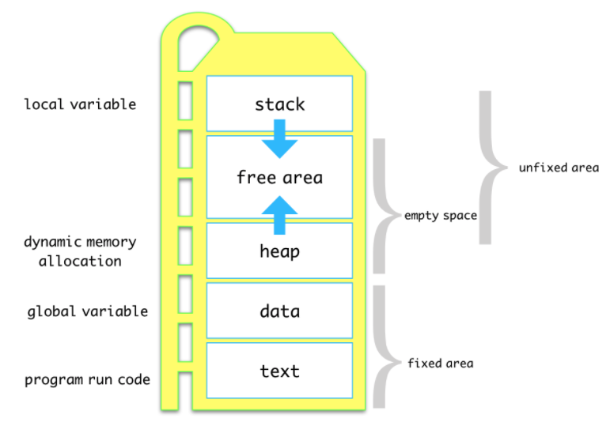
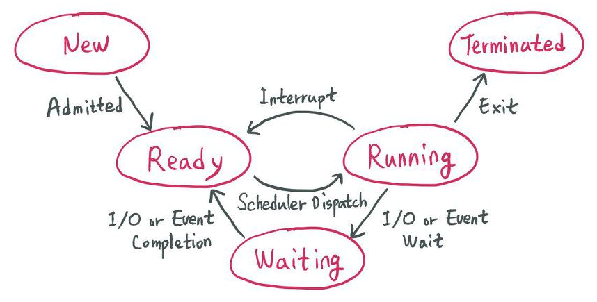

# 프로세스와 컨텍스트 스위칭

## 1. 먼저 프로세스란?
`Process: A process is a program in execution which then forms the basis of all computation`

실행중인 프로그램을 의미함, 그렇다면 실행중인 프로그램이라는 것은 도대체 무엇을 정확히 말하는 것일까?

프로세스는 크게 이미지 영역과 컨텍스트 영역으로 구분되어 있습니다. **프로세스의 컨텍스트 영역**은 **Data Reigster, $PC, $SP 등의 값들이 저장**되고, **프로세스 이미지 영역**에는 우리가 흔히 말하는 **스택, 힙 데이터, 코드영역**이 존재합니다.

다음 그림을 통해 프로세스의 이미지 영역을 자세히 살펴봅시다. 

프로세스 이미지 구조는 위와 같습니다. 제일 작은 **메모리 주소 부분에는 Text(Code)영역**이 있고, 이곳에는 실행 가능한 코드들이 **컴파일한 기계어 형태로 저장**됩니다. 그리고 그 위에는 초기화해서 변하지 않는 변수를 저장하고, 다시 . 그위에 아직 초기화 하지 않은 전역 변수나 정적 변수를 저장합니다. 이 부분을 엄밀히 구분할 수도 있는데, 여기서는 **Data 영역**으로 지정합니다. 

Stack 영역에는 지역변수(임시변수, 매개변수, return value, return address)등이 저장됩니다. 여기서 return address란 어떤 함수를 호출하고 그 결과를 다시 main이나 다른 함수에 return 해야 할때, 돌아갈 곳을 명시해주는 주소를 담는 공간입니다. 

참고로 Stack 영역은 **컴파일 타임에 크기가 결정되기 때문에** 무한히 할당할 수가 없습니다. 때문에 재귀함수가 너무 많이 호출 되거나, 함수가 지역변수를 너무 많이 가지고 있어서 Stack영역을 초과하게 되면 StackOverflow 에러가 발생하기도 합니다. 

Heap 메모리 영역에는 프로그램 런타임에 동적 메모리가 할당됩니다. 쉽게 말해 이 영역에는 **객체의 데이터가 저장**된다고 볼 수 있고, 스택 영역에는 **이 객체들에 대한 참조값**이 저장되어 있어서 이를 통해 힙 영역에 존재하는 객체의 데이터에 접근할 . 수있게 됩니다.

## 2. PCB(Process Control Block)
위에서 우리는 프로세스를 실행중인 프로그램이라고 했고, 이를 조금 다르게 정의하면 프로세스는 곧 **실행가능한 PCB**(Process Control Block)를 가진 프로그램이라고 볼 수도 있는데요

PCB는 운영체제가 프로세스를 제어하기 위해서 정보를 저장해놓는 곳으로 프로세스의 상태정보를 저장하는 구조체 라고 생각하면 됩니다. 

프로그램을 돌아간다는 것은 많은수의 프로세스가 돌아간다는것을 의미하는데요, 그리고 이러한 프로세스들은 Time Sharing을 하거나, 서로 참조하는 등으로 컨텍스트 스위칭을 하게 되는데 이를 위해서 각 프로세스의 상태를 저장할 공간인 PCB가 필요하게 된다는 것입니다. 

PCB는 아래 그림과 같은 구조로 생겼습니다.
|Process ID|
|:---:|
|Process state|
|Process counter|
|Register information|
|Scheduling information|
|Memory related information|
|Accounting information|
|Status information related to I/O|

- Process ID: 프로세스 고유 번호
- Processs State: 프로세스 준비, 대기, 실행 등의 상태정보를 가짐
- Process counter: 프로세스가 다음에 실행할 명령어의 주소를 저장
- Register information: 메모리 연산을 위해 임시로 가지고 있는 기억공간으로 CPU 옆에 위치
- Scheduling information: 자신이 CPU 스케쥴링에서 어떤 우선 순위를 가지고 있는지에 대한 정보
- Memory related information: 할당된 자원 정보
- Accounting information: 프로세스를 처리하고 있는 CPU의 사용시간, 실제 사용된 시간등이 담겨있고 
- Status information related to I/O: 입출력 상태정보, 프로세스에 할당된 입출력 장치의 목록이나 열린 파일 목록등을 젖장하고 있음

## 3. Context switching
### - 1. 왜 필요해?
Context swithcing은 결국 한개의 CPU가 한개의프로세스만 처리할 수 있기 때문에 필요해진 개념입니다. 

CPU가 하나의 프로세스를 끝날때까지 계속 처리하고, 그 다음에서야 다음 프로세스를 처리할 . 수있다면 프로세스들간의 참조도 이루어질 수 없고, 프로세스 간 병목현상도 심화됩니다.

따라서 CPU는 실행중인 프로세스를 계속해서 변화시키는데 이 과정을 컨텍스트 스위칭이라고 합니다. 
### - 2. 어떻게 실행되는가?
위에 PCB의 설명처럼 PCB는 Process Counter에 다음에 실행할 프로세스의 주소를 가지고 있는데, Context Switching이 발생할떄는 현재 프로세스의 PCB에서 다음 프로세스의 PCB를 찾아서 레지스터에 적재하고, CPU가 이전에 진행했던 과정을 이어서 진행합니다.

그런데 **이때!** 프로세스는 각 독립된 메모리 영역을 할당받았기 떄문에 공유하는 메모리가 존재하지 않습니다. 따라서 Context Switching이 발생할떄

**(1)캐시초기화, (2)메모리 매핑 초기화, (3)커널모드**로의 진입이라는 세가지 비용을 항상 수반하고, 이로 인해 큰 오버헤드가 발생하게 됩니다.

## 4. 프로세스의 상태
한편, 우리의 프로그램은 여러 프로세스를 동시에 처리해야 하기 떄문에 프로세스가 실행되는 동안 아래 그림처럼 계속해서 상태가 변합니다.

프로세스가 생성된 상태(New), CPU를 할당받기 위해 준비중인 상태(Ready), 어떤 이벤트를 기다리고 있는 상태(Blocked(waiting)), Instruction(명령어)가 실행되고 있는 상태(Running), 종료 상태(Terminated)가 있다. 

인터럽트를 공부했을때 System Call을 호출하게 되면 해당 프로세스는 Blocked 상태로 변하며, OS는 커널 모드로 진입하게 됩니다. 그러면 그동안 CPU는 다른 Process를 돌리고 있습니다.

System call을 호출하는 동안 CPU가 아무일도 하고 있지 않으면 낭비이기 떄문

시간이 지나 System operation이 끝나면 다시 CPU에게 Interrupt를 발생시킵니다. Interrupt를 받은 CPU는 현재 실행중인 프로세스를 멈추고, 커널모들 돌아가 Interrupt를 Handling 합니다. 그리고 이전 프로세스를 다시 Ready 상태로 돌려놓습니다. 

Ready 상태의 프로세스는 우선순위나 CPU 점유 상태에 따라 다시 Running 상태로 될 준비를 합니다. 이를 그림으로 나타내면 다음과 같습니다.

프로세스가 Ready Queue에 들어와서 다시 재가동되는것은 CPU 스케줄링에 의해 좌지우지 되는 내용으로 이 부분에 대해서는 CPU스케줄링에서 다루겠습니다. 

## Mode Switching Vs Context Switching
이전 글에서 공부했던 것처럼 유저모드~ 커널 모드간의 스위칭은 세가지 상황에서 일어납니다.

1. Hardware Externel interrupt(Timer, I/O Interrupt)
2. Software Exception(Page fault, invalid operations..)
3. System Call(I/O Operation, fort()...)

그리고 이렇게 유저모드와 커널 모드간의 스위칭 과정을 **모드스위칭** 이라 하며, 모드 스위칭은 위에서 살펴본 프로세스간의 Context Switching과는 다른 개념입니다. 

모드 스위칭이 일어날떄는 현재 프로세스의 상태를 저장하고, 프로그램 카운터를(PC)를 다음 작업을 할 주소값으로 세팅합니다. 그리고 커널모드로 전환해 수행해야 하는 Instruction을 핸들링합니다. 

한편 Context Switching은 **모드 스위칭의 결과**으로 발생합니다. 즉 인터럽트, Exception, System Call 등이 일어나면 Mode Swtiching이 일어나고, 이에 따라 필요시 

Context Switching이 일어나는 것입니다.

